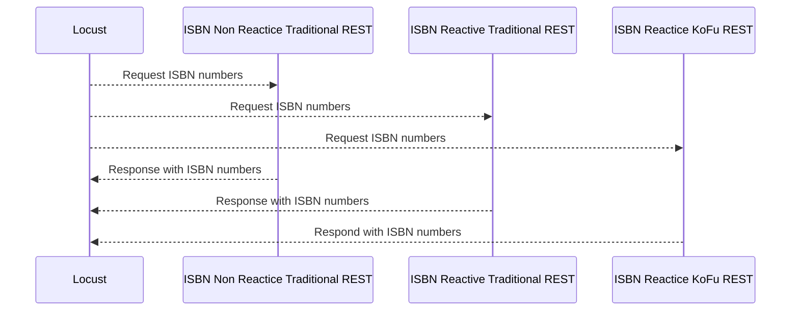

# isbn-stacks

---
[](https://github.com/jesperancinha/isbn-stacks)
[](#)
[](https://www.apache.org/licenses/LICENSE-2.0)

[](https://circleci.com/gh/jesperancinha/isbn-stacks)
[](https://ci.appveyor.com/project/jesperancinha/isbn-stacks)
[](https://github.com/jesperancinha/isbn-stacks/actions/workflows/isbn-stacks.yml)
[](https://github.com/jesperancinha/isbn-stacks/actions/workflows/isbn-stacks-e2e.yml)

[](https://www.codacy.com/gh/jesperancinha/isbn-stacks/dashboard?utm_source=github.com&amp;utm_medium=referral&amp;utm_content=jesperancinha/isbn-stacks&amp;utm_campaign=Badge_Grade)
[](https://snyk.io/test/github/jesperancinha/isbn-stacks)

[](https://www.codacy.com/gh/jesperancinha/isbn-stacks/dashboard?utm_source=github.com&utm_medium=referral&utm_content=jesperancinha/isbn-stacks&utm_campaign=Badge_Coverage)
[](https://coveralls.io/github/jesperancinha/isbn-stacks?branch=main)
[](https://codecov.io/gh/jesperancinha/isbn-stacks)

[](#)
[](#)
[](#)

---

## Technologies used

Please check the [TechStack.md](TechStack.md) file for details.

## Introduction

Worldwide, the number ISBN 13 is used. It is a massive collection of numbers which uniquely identify books per type and edition. Based on that, this project is here to evaluate the recent experimental project from the spring team called Spring-FU. A DSL that, when released, it will allow Spring applications to be developed without the use of annotations. The main argument is that annotations bring unnecessary overhead to the application and that processing time can be avoided. The Spring-FU projecct started in GitHub on the 31st of  May 2018.

This repo is also the official support repo to my article on [Dev.to](https://dev.to/):

[](https://dev.to/jofisaes/isbn-stacks-a-look-at-a-possible-spring-application-implementation-without-annotations-67l)


> Note that this project will soon be migrated to Ktor...

#### Stable releases

-   [1.0.0](https://github.com/jesperancinha/isbn-stacks/tree/1.0.0) - [d76ef9d6316e97210ff8a9759e7f1bc811ebc153](https://github.com/jesperancinha/isbn-stacks/tree/1.0.0) - Last working version before Spring 3.0.0

## Project Layout

-   [ISBN Stacks - Common](./isbn-stacks-common) - The common library where the static source data resides
-   [ISBN Stacks - Spring KoFu Reactive Application](./isbn-stacks-rest-kofu-mvc-reactive) - Spring KoFu reactive application implemented in Kotlin
-   [Spring KoFu Reactive Application With Nothing](./isbn-stacks-rest-kofu-plain) - Spring KoFu implementatio completely stripped of extra functions to be used as a reference control in the performance tests.
-   [ISBN Stacks - Spring Web application](./isbn-stacks-rest-traditional-mvc-non-reactive) - Spring Web Application implemented in a non-reactive way.
-   [ISBN Stacks - Spring WebFlux reactive application](./isbn-stacks-rest-traditional-mvc-reactive) - Spring WebFlux Application implemented in a reactive way.
-   [locust](./locust) - The location of all Locust tests

## Sequence diagram

To visualize this diagram you may need the [mermaid-diagrams](https://chrome.google.com/webstore/detail/mermaid-diagrams/phfcghedmopjadpojhmmaffjmfiakfil) plugin installation.

To visualize it in Intellij, please install the [mermaid plugin](https://mermaid-js.github.io/mermaid/#/).


## Java Setup

```shell
sdk install java 17-open
sdk use java 17-open
```

## References

-   [The evolution of Spring Fu](https://spring.io/blog/2018/10/02/the-evolution-of-spring-fu)
-   [The State of Kotlin Support in Spring](https://blog.jetbrains.com/kotlin/2020/08/the-state-of-kotlin-support-in-spring/)
-   [Spring Fu 0.3.0 and beyond](https://spring.io/blog/2020/05/28/spring-fu-0-3-0-and-beyond)
-   [Mermaid Live Editor](https://mermaid-js.github.io/mermaid-live-editor)
-   [Spring Framework 5.0 Released](https://www.infoq.com/news/2017/10/spring-5-released/)
-   [JAX Innovation Award Winners](https://blogs.eclipse.org/post/ian-skerrett/jax-innovation-award-winners)
-   [Agitar Wins 2006 Software Development Magazine Productivity Award](http://www.agitar.com/news/pr/20060322.html)
-   [16th Jolt Awards 2006](http://blog.sina.com.tw/4907/article.php?pbgid=4907&entryid=12167)
-   [The 16th annual jolt product Excellence Award winners)](https://topic.alibabacloud.com/a/the-16th-annual-jolt-product-excellence-award-winners_8_8_32396776.html)
-   [JetBrains Products Win Jolt Productivity Awards](https://blog.jetbrains.com/idea/2006/03/jetbrains-products-win-jolt-productivity-awards/)
-   [Spring Framework](https://en.wikipedia.org/wiki/Spring_Framework)
-   [java spring - natashasweety7/Software Wiki](https://github-wiki-see.page/m/natashasweety7/Software/wiki/java-spring)
-   [A Guide to Spring Framework Annotations](https://dzone.com/articles/a-guide-to-spring-framework-annotations)
-   [What is New in Spring Framework 4.x](https://www.dineshonjava.com/whats-new-in-spring-framework-4x/)
-   [Nicolas Fränkel-Annotation-free Spring](https://nfrankel.medium.com/annotation-free-spring-dcdbefd57fe8)
-   [Spring-Fu GitHub Repo](https://github.com/spring-projects-experimental/spring-fu)
-   [Spring KoFu](https://github.com/spring-projects-experimental/spring-fu/tree/main/kofu)

## About me

[](https://github.com/jesperancinha)
